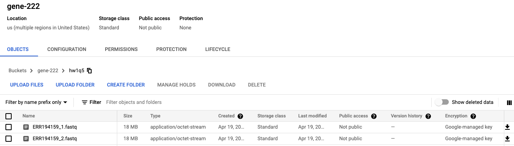
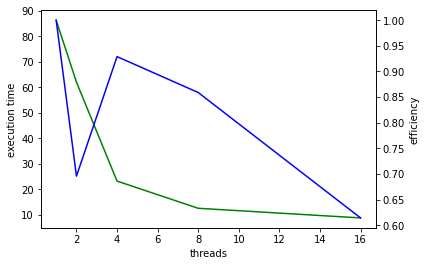

# gene-222 HW 1

1. Here are the screenshots of my AWS and GCP accounts:

#### AWS


#### GCP


2.
    a. This is an example of strong scaling because the workload remains the same but gets further distributed to multiple processes.
    
    b. combined with part c below
    
    c. Table of calculations:
    
    | Threads  | Time | Speedup | Efficiency | 
    | -------- | ---- | ------- |------------|
    | 1 | 750  | 1 | 1 |
    | 2 | 410  | 1.8292 | 0.9146 | 
    | 4 | 204  | 3.6765 | 0.9191 |
    | 8 | 98   | 7.6531 | 0.9566 |
    | 16| 63   | 11.9048| 0.74405 | 
    
    d. 8 threads is the most efficient configuration based off of the efficiency calculations

3. 
    a. I successfully configured the environment.

    b. The Dockerfile is available [here](./Dockerfile). I ran the following commands to demonstrate that my bowtied configuration worked:
    ```
    docker build -t bowtie.v1.3.0 .
    docker run bowtie.v1.3.0 bowtie e_coli reads/e_coli_1000.fq > docker.log
    ```
    c. The full output from the command is available in [docker.log](./docker.log)

4. 5 Docker best practices:
    1. Limit your build context: docker sends all of the files in your current working directory to the "build context" so you want to make sure your working directory where you're running builds doesn't have a ton of data in it.
    2. Take advantage of the build cache: The docker container will cache the build up to the point where you most recently made changes. You can develop way more quickly if you get the "compmutationally heavy" part of the build done early on in the dockerfile so that it's more likely to remain cached as you're developing the image.
    3. Start with the appropriate base image: many of the popular packages managers for bioinformatics software such as conda and bioconductor etc. have pre-built images that are optimized for a specific context. Rather than rebuild the wheel, use these images as your base-image
    4. Don't store data in the image: you can rely on reference volumes to mount data files inside of the docker image. You want to keep the image itself as lightweight as possible.
    5. Don't use the `latest` tag for production images: the point of Docker is for a process to be reproducible across different environments and at different time points. If you use the `latest` tag for a base image, when the base image gets updated then your build will change. This can lead to some headaches. It's better to pin your base image to a specific version to assure that your code and environment is reproducible over time. 


5. 
    a. I succesfully installed dsub
    b. I successfully enabled the APIs
    c. I succesfully downloaded the files from the public bucket (this took a while!)
    d. I succesfully installed and subsetted the fastq files.
    e. I succesfully uploaded the files to GCS. Screenshot below:
    
    f. I succesfully executed the bwa image usng dsub.
    
    Here's an example of the command that I ran:

    ```
    dsub \
    --provider google-v2 \
    --project steel-watch-346516 \
    --zones "us-central1-a" \
    --logging gs://gene-222/hw1q5/log/ \
    --input-recursive FASTQ_INPUT=gs://gene-222/hw1q5/ \
    --input-recursive REFERENCE=gs://gene222_datasets_references/REFERENCE_GRCH37 \
    --output OUTPUT_FILE=gs://gene-222/hw1q5/OUTPUT_BWA/* \
    --machine-type n1-standard-8 \
    --image pegi3s/bwa \
    --command 'bwa mem -t 8 -M -R "@RG\\tID:0\\tLB:Library\\tPL:Illumina\\tSM:" "${REFERENCE}"/GRCh37-lite.fa "${FASTQ_INPUT}"/ERR194159_1.fastq "${FASTQ_INPUT}"/ERR194159_2.fastq > "$(dirname ${OUTPUT_FILE})"/bwa-sam.sam'
    ```
    I modified this command 5 times, each time replacing the number of threads and the machine type to correspond to the particular parallel configuration that I was trying to execute. Here's the table:

    | Machine  | Threads | Execution Time | Speed Up | Efficiency | Log file |
    | -------- | ---- | ------- |------------|----|---|
    | n1-standard-2 | 1 | 86.291 | 1 | 1 | gs://gene-222/hw1q5/log/bwa--jack-michuda--220420-031056-50.log|
    | n1-standard-2 | 2 | 62.018 | 1.3914 | 0.6957 | gs://gene-222/hw1q5/log/bwa--jack-michuda--220420-032525-96.log |
    | n1-standard-4 | 4 | 23.221 | 3.7160 | 0.9290 | gs://gene-222/hw1q5/log/bwa--jack-michuda--220420-033057-38.log
    | n1-standard-8 | 8 | 12.558 | 6.8713 | 0.8589 | gs://gene-222/hw1q5/log/bwa--jack-michuda--220420-025041-13.log |
    | n1-standard-16 |16| 8.781  | 9.8270 | 0.6141 | gs://gene-222/hw1q5/log/bwa--jack-michuda--220420-033551-59.log |

    And here is a plot showing the performance as a function of the number of threads:
    
