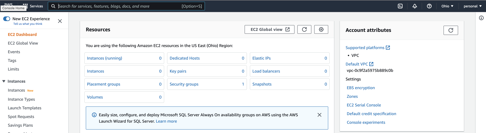
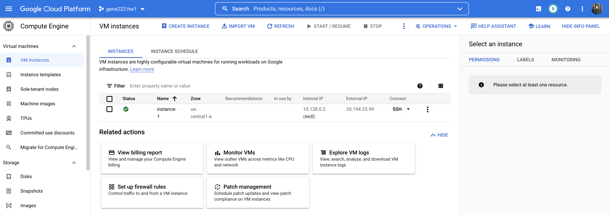

# gene-222 HW 1

1. Configure your GCP+AWS accounts (10 points) [submit screenshots]

#### AWS


#### GCP



2. To do!
3. 
A. How do we show that we have successfully set up the docker commands?

B.

The Dockerfile is available [here](./Dockerfile). I ran the following commands to demonstrate that my bowtied configuration worked:
```
docker build -t bowtie.v1.3.0 .
docker run bowtie.v1.3.0 bowtie e_coli reads/e_coli_1000.fq > docker.log
```
The full output from the command is available in [docker.log](./docker.log)

4. List 5 Docker best practices:
1. Limit your build context: docker sends all of the files in your current working directory to the "build context" so you want to make sure your working directory where you're running builds doesn't have a ton of data in it.
2. Take advantage of the build cache: The docker container will cache the build up to the point where you most recently made changes. You can develop way more quickly if you get the "compmutationally heavy" part of the build done early on in the dockerfile so that it's more likely to remain cached as you're developing the image.


5. To do!
